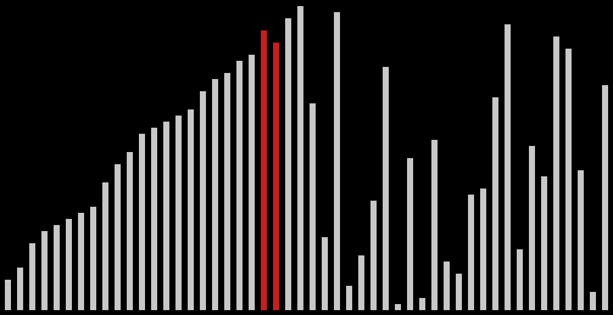

# Sorting Visualizer

## Overview

SortVisualizer is an interactive Python application that allows you to visualize different sorting algorithms in real-time. Using Pygame, this tool provides a graphical representation of how various sorting algorithms work, helping users understand the mechanics of sorting processes.

## Features

-   Visualize multiple sorting algorithms:

    -   Bubble Sort
    -   Insertion Sort
    -   Merge Sort

-   Customizable array generation:

    -   Random arrays
    -   Reverse sorted arrays
    -   Already sorted arrays
    -   Nearly sorted arrays

-   Interactive controls:
    -   Pause/Resume sorting
    -   Step forward/backward through sorting process
    -   Sound feedback representing array element values
    -   Reset visualization

## Prerequisites

Before running the project, ensure you have the following installed:

-   Python 3.7+
-   Pygame
-   Pygame Menu
-   NumPy

## Installation

1. Clone the repository:

    ```
    git clone https://github.com/yourusername/SortVisualizer.git
    cd SortVisualizer
    ```

2. Install required dependencies:
    ```
    pip install pygame pygame-menu numpy
    ```

## How to Run

Simply execute the `visualize.py` script:

```
python visualize.py
```

## Controls

-   **Space**: Pause/Resume sorting
-   **Right Arrow** / **D**: Step forward
-   **Left Arrow** / **A**: Step backward
-   **R**: Reset and return to menu
-   **Q**: Quit the application

## Menu Options

-   **Array Size**: Select the number of elements to sort (10-100)
-   **Array Type**: Choose initial array configuration
-   **Algorithm**: Select sorting algorithm to visualize

## Screenshots

The SortVisualizer application provides real-time visualization of various sorting algorithms. Here's an example of the Merge Sort algorithm sorting a random array:



## Project Structure

-   `visualize.py`: Main visualization logic and Pygame interface
-   `sort.py`: Implementation of sorting algorithms as generator functions

## Contributing

Contributions are welcome! Feel free to:

-   Add new sorting algorithms
-   Improve visualization techniques
-   Enhance user interface
